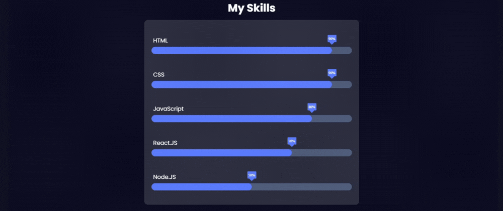

## Introduction:
Skill progress bars are a common feature in portfolios and resumes, allowing users to visually showcase their expertise in various areas. In this article, we'll explore how to create dynamic and interactive skill progress bars using HTML, CSS, and JavaScript.

## HTML Structure:
We begin by defining the HTML structure for our skill progress bars. We use semantic HTML elements such as <section>, <h3>, <div>, and <p> to organize the content. Each skill is represented by a container with a name, a progress bar, and a percentage indicator.

```html
<!DOCTYPE html>
<html lang="en">
<head>
    <meta charset="UTF-8">
    <meta name="viewport" content="width=device-width, initial-scale=1.0">
    <link rel="stylesheet" href="styles.css">
    <link href="https://fonts.googleapis.com/css2?family=Poppins:ital,wght@0,100;0,200;0,300;0,400;0,500;0,600;0,700;0,800;0,900;1,100;1,200;1,300;1,400;1,500;1,600;1,700;1,800;1,900&display=swap" rel="stylesheet"> <!-- importing "Poppins" font family from google font -->
    <title>Skill Bar</title>
</head>
<body>
    <section class="skills" id="skills">
        <h3 class="skills-header">My Skills</h3>
        <div class="skills-container">
            <div class="skill-container">
                <p>HTML</p>
                <div class="percentage html-percentage">90%</div>
                <div class="bar">
                    <span class="html"></span>
                </div>
            </div>

            <div class="skill-container">
                <p>CSS</p>
                <div class="percentage css-percentage">90%</div>
                <div class="bar">
                    <span class="css"></span>
                </div>
            </div>

            <div class="skill-container">
                <p>JavaScript</p>
                <div class="percentage javascript-percentage">80%</div>
                <div class="bar">
                    <span class="javascript"></span>
                </div>
            </div>

            <div class="skill-container">
                <p>React.JS</p>
                <div class="percentage react-percentage">70%</div>
                <div class="bar">
                    <span class="react"></span>
                </div>
            </div>

            <div class="skill-container">
                <p>Node.JS</p>
                <div class="percentage node-percentage">50%</div>
                <div class="bar">
                    <span class="node"></span>
                </div>
            </div>
        </div>
    </section>
    <script src="./script.js"></script>
</body>
</html>
```

## CSS Styling:
Next, we style our skill progress bars using CSS. We define styles for the overall layout, skill containers, progress bars, and percentage indicators. We also incorporate animations to enhance the visual appeal of the bars.

```css
*,
::before,
::after{
    padding: 0;
    margin: 0;
    box-sizing: border-box;
}

body{
    width:100%;
    height:100vh;
    background:#111222 ;
    display: flex;
    flex-direction: column;
    align-items: center;
    justify-content: center;
    padding:20px;
}

.skills{
    width: 600px;
    min-width:300px;
    max-width: 100%;
    color:#fff;
    display:flex;
    flex-direction: column;
    align-items: center;
    justify-content: center;
}

.skills-header{
    font-family: "Poppins", sans-serif;
    font-size: 30px;
    width:100%;
    text-align: center;
    margin-bottom: 10px;
    box-sizing: border-box;
}

.skills-container{
    max-width: 100%;
    width:100%; 
    display:flex;
    flex-direction: column;
    align-items: center;
    justify-content: center;
    background: rgba(255, 255, 255, 0.1);
    backdrop-filter: blur(20px);
    border-radius: 10px;
    padding:20px;
    margin:0;
    box-sizing: border-box;
}


 .skill-container{
    width:100%;
    margin:10px 0;
    padding: 10px 0;
    position:relative;
 }

 .skill-container p{
    margin: 5px;
    font-family: "Poppins", sans-serif;
    font-size: 16px;
 }

 .bar{
    width:100%;
    background: #475472;
    display:block;
    height: 20px;
    border:none;
    border-radius: 100vw;
    overflow: hidden;
    transition: all .3s cubic-bezier(.25, 8, .25, 1);
 }

 .bar span{
    height:20px;
    float: left;
    background: #5271ff;
    border:none;
    border-radius: 100vw;
 }

/* adding animation to skill bar */

 .html.animate, .css.animate{
    width: 90%;
    animation: html_css 3s;
 }

 .javascript.animate{
    width:80%;
    animation: javascript 3s;
 }

 .react.animate{
    width:70%;
    animation: react 3s;
 }

 .node.animate{
    width:50%;
    animation: node 3s;
 }

 @keyframes html_css{
    0%{
        width:0%
    };

    100%{
        width:90%
    }
 }

 @keyframes javascript{
    0%{
        width:0%
    };

    100%{
        width:80%
    }
 }

 @keyframes react{
    0%{
        width:0%
    };

    100%{
        width:70%
    }
 }

 @keyframes node{
    0%{
        width:0%
    };

    100%{
        width:50%
    }
 }

 .percentage{
    content: "";
    position: absolute;
    top:12px;
    width:25px;
    height:20px;
    background: #5271ff;
    display:flex;
    align-items: center;
    justify-content: center;
    font-size: 10px;
    border-radius: 2px;
    z-index: 10;
    transition: all .3s ease-in-out;
 }

 .percentage::after{
    content: "";
    position: absolute;
    top:15px;
    left:50%;
    transform: translateX(-50%) rotate(45deg);
    margin: auto;
    width:10px;
    height:10px;
    background: #5271ff;
    z-index:-1;
 }

 /* adding animation to .percentage */

 .html-percentage.animate,
 .css-percentage.animate{
    left:90%;
    animation: html_css_percentage 3s;
 }

 .javascript-percentage.animate{
    left:80%;
    animation: javascript_percentage 3s;
 }

 .react-percentage.animate{
    left:70%;
    animation: react_percentage 3s;
 }

 .node-percentage.animate{
    left:70%;
    animation: react_percentage 3s;
 }

 @keyframes html_css_percentage{
    0%{
        left:0
    };
    100%{
        left:90%;
    }
 }

 @keyframes javascript_percentage{
    0%{
        left:0
    };
    100%{
        left:80%;
    }
 }

 @keyframes react_percentage{
    0%{
        left:0
    };
    100%{
        left:70%;
    }
 }

 @keyframes node_percentage{
    0%{
        left:0
    };
    100%{
        left:50%;
    }
 }
```

## JavaScript Interaction:
To make our skill progress bars interactive, we use JavaScript. We employ the Intersection Observer API to trigger animations when the bars come into view. Additionally, we dynamically calculate and set the position of the percentage indicators based on the width of the bars.

```javascript
const observer = new IntersectionObserver(entries => {
    entries.forEach(entry => {
        spans.forEach((span, index) => {
            const percentage = percentages[index];
            if (entry.isIntersecting) {
                span.classList.add('animate');
                percentage.classList.add('animate');
            } else {
                span.classList.remove('animate');
                percentage.classList.remove('animate');
            }
        });
    });
});

const skillContainer = document.querySelector('.skills-container');
const spans = document.querySelectorAll('.bar span');
const percentages = document.querySelectorAll('.percentage');
observer.observe(skillContainer);

function updatePercentagePositions() {
    const barWidth = document.querySelector('.bar').clientWidth;
    percentages.forEach(percentage => {
        const widthPercentage = parseFloat(percentage.textContent) / 100;
        percentage.style.left = `${barWidth * widthPercentage - 12.5}px`;
    });
}

updatePercentagePositions(); // Call initially
```
## Conclusion:
In this tutorial, we've learned how to create interactive skill progress bars using HTML, CSS, and JavaScript. By combining these technologies, we can build visually appealing and engaging elements for showcasing our skills on websites and portfolios.